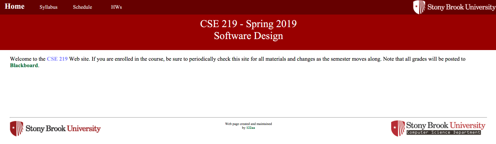

CourseSiteGenerator
========
Desktop application that builds a custom webpage. This app require no programming knowledge to its users. It will prompt the user to input information about the webpage. The user can choose the style of the page, and things they want to import such as charts and images.

***
# Page Design Tab

The tool bar on the top includes create new, open, close, save, generate web Page, Exit, Undo, Redo, Help, Language, and About.

# Language Changed

# Generated WebPage 

*** 
# Event Design Tab

# Generated WebPage

***
# Office Hour Tab
##### Notice the email address imput is invalid, so the add TA tab is disabled. This is one of the fool-proof functions that prevents mistakes.

# generated WebPage
